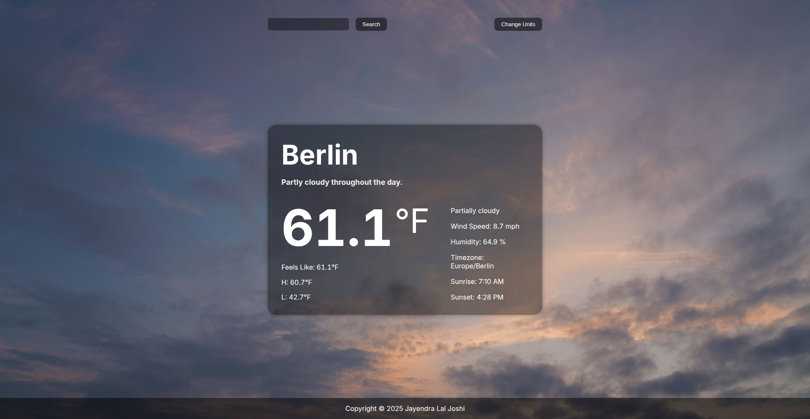

# Weather App

A modern, responsive weather application that provides real-time weather data for any city worldwide. The app is automatically built and deployed to GitHub Pages using a GitHub Actions workflow.

## About This Project

This weather app is a project from [The Odin Project](https://www.theodinproject.com/lessons/node-path-javascript-weather-app) JavaScript curriculum.

## What I Learned

Through this project, I learned how to fetch and process data from external APIs, handle asynchronous operations with promises, and implement asnychronous error handling.

## Technologies And Tools Used

- HTML5
- CSS3
- JavaScript (ES6+)
- Webpack
- Visual Crossing Weather API
- Git & GitHub Pages
- Github Actions
- EsLint
- Prettier

## Features

- Get real-time data of current temperature, overall conditions, humidty, windspeed and more
- Search for any city worldwide
- Responsive design for smaller screens

## Getting Started

1. Clone the repo: `git clone https://github.com/JayendraJoshi/Weather-App.git`
2. Install dependencies: `npm install`
3. Run locally: `npm run dev`
4. Build for production: `npm run build`

## Live Demo

- GitHub Pages: https://jayendrajoshi.github.io/Weather-App/
- AWS Amplify: https://gh-pages.d2pcoii5uca4lp.amplifyapp.com/

## Screenshots

## Resoruces

## Background Image source

https://pixabay.com/de/photos/sky-sunset-sun-nature-sunrise-5007053/
